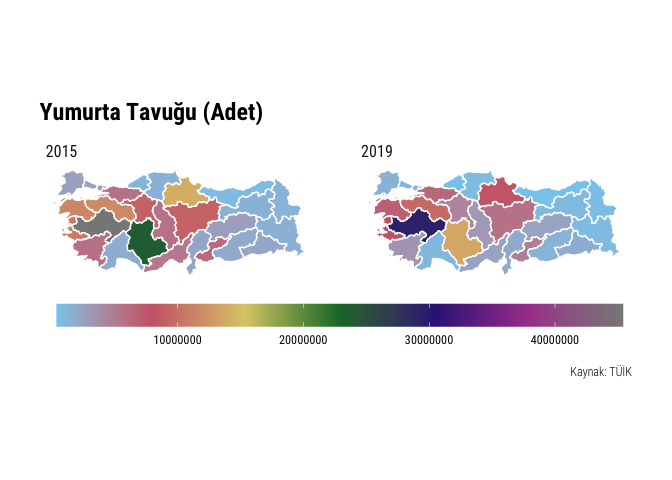
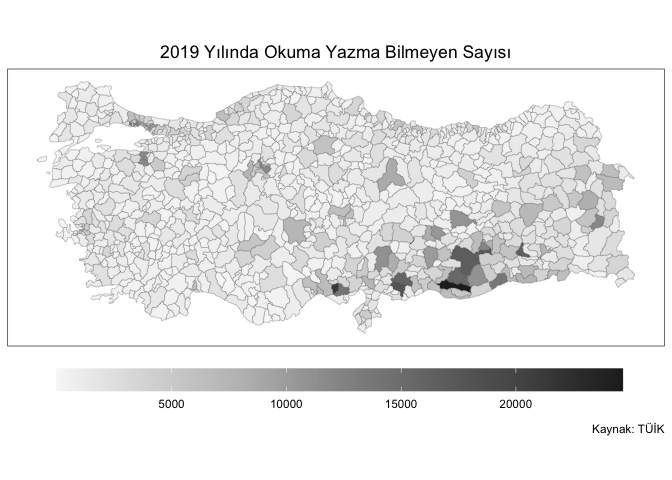

<!-- README.md is generated from README.Rmd. Please edit that file -->

# tuik

<!-- badges: start -->

[](https://www.tidyverse.org/lifecycle/#experimental)
[](https://github.com/emraher/tuik/actions)
[](https://zenodo.org/badge/latestdoi/313863336)
<!-- badges: end -->

The goal of `tuik` is to extract data file and database URLs from
[TUIK](https://data.tuik.gov.tr/) webpage. Package can also download
data from [Geographical Statistics Portal](https://cip.tuik.gov.tr/).

## Installation

You can install the development version from
[GitHub](https://github.com/emraher/tuik) with:

``` r
# install.packages("devtools")
devtools::install_github("emraher/tuik")
```

## Example

``` r
library(tidyverse)
library(tuik)

(st <- statistical_themes())
#> # A tibble: 17 x 2
#>    theme_name                         theme_id
#>    <chr>                              <chr>   
#>  1 Adalet ve Seçim                    110     
#>  2 Bilim, Teknoloji ve Bilgi Toplumu  102     
#>  3 Çevre ve Enerji                    103     
#>  4 Dış Ticaret                        104     
#>  5 Eğitim, Kültür, Spor ve Turizm     105     
#>  6 Ekonomik Güven                     117     
#>  7 Enflasyon ve Fiyat                 106     
#>  8 Gelir, Yaşam, Tüketim ve Yoksulluk 107     
#>  9 İnşaat ve Konut                    116     
#> 10 İstihdam, İşsizlik ve Ücret        108     
#> 11 Nüfus ve Demografi                 109     
#> 12 Sağlık ve Sosyal Koruma            101     
#> 13 Sanayi                             114     
#> 14 Tarım                              111     
#> 15 Ticaret ve Hizmet                  115     
#> 16 Ulaştırma ve Haberleşme            112     
#> 17 Ulusal Hesaplar                    113

# stab <- statistical_tables("aaa")
#> Error in check_theme_id(theme) : 
#>  You should select a valid theme ID!

# stab <- statistical_tables(c(123, 143))
#> Error in check_theme_id(theme) : You can select only one theme!

(stab <- statistical_tables("110"))
#> # A tibble: 54 x 5
#>    theme_name   theme_id data_name                data_date  datafile_url               
#>    <chr>        <chr>    <chr>                    <date>     <chr>                      
#>  1 Adalet ve S… 110      Suç Türü ve Suçun İşlen… 2020-11-02 http://data.tuik.gov.tr/Bu…
#>  2 Adalet ve S… 110      İBBS, 3. Düzeyde, Suç T… 2020-11-02 http://data.tuik.gov.tr/Bu…
#>  3 Adalet ve S… 110      Suç Türü ve Uyruğuna Gö… 2020-11-02 http://data.tuik.gov.tr/Bu…
#>  4 Adalet ve S… 110      Suç Türü ve Medeni Duru… 2020-11-02 http://data.tuik.gov.tr/Bu…
#>  5 Adalet ve S… 110      Suç Türü ve Eğitim Duru… 2020-11-02 http://data.tuik.gov.tr/Bu…
#>  6 Adalet ve S… 110      İBBS 3. Düzeyde, Daimi … 2020-11-02 http://data.tuik.gov.tr/Bu…
#>  7 Adalet ve S… 110      Hükümlü ve Tutuklu Sayı… 2020-11-02 http://data.tuik.gov.tr/Bu…
#>  8 Adalet ve S… 110      İBBS, 1. Düzeyde, Suç T… 2020-11-02 http://data.tuik.gov.tr/Bu…
#>  9 Adalet ve S… 110      Suç Türü ve Suçun İşlen… 2020-11-02 http://data.tuik.gov.tr/Bu…
#> 10 Adalet ve S… 110      Suç Türü ve Uyruğuna Gö… 2020-11-02 http://data.tuik.gov.tr/Bu…
#> # … with 44 more rows

# sdb <- statistical_databases("aaa")
#> Error in check_theme_id(theme) : 
#>  You should select a valid theme ID!

# sdb <- statistical_databases(c(123, 143))
#> Error in check_theme_id(theme) : You can select only one theme!

(sdb <- statistical_databases(110))
#> # A tibble: 6 x 4
#>   theme_name    theme_id db_name                            db_url                      
#>   <chr>         <chr>    <chr>                              <chr>                       
#> 1 Adalet ve Se… 110      "Milletvekili Seçim Sonuçları "    http://biruni.tuik.gov.tr/s…
#> 2 Adalet ve Se… 110      "Mahalli İdareler Seçim Sonuçları… http://biruni.tuik.gov.tr/s…
#> 3 Adalet ve Se… 110      "Cumhurbaşkanlığı Seçimi / Halk O… http://biruni.tuik.gov.tr/s…
#> 4 Adalet ve Se… 110      "Ceza İnfaz Kurumuna Giren Hüküml… http://biruni.tuik.gov.tr/g…
#> 5 Adalet ve Se… 110      "Güvenlik Birimine Gelen veya Get… http://biruni.tuik.gov.tr/m…
#> 6 Adalet ve Se… 110      "Ceza İnfaz Kurumundan Çıkan (Tah… http://biruni.tuik.gov.tr/c…

# -------------------------------------------------------------------------- ###
# Saving Data Files----
# -------------------------------------------------------------------------- ###
# Read xls files directly into R
# NOTE: TUIK xls files are messy!!!
(dt <- tibble::as_tibble(gdata::read.xls(stab$datafile_url[1])))
#> # A tibble: 433 x 256
#>    Suç.türü.ve.suç… X     X.1   X.2     X.3 X.4   X.5   X.6   X.7   X.8   X.9   X.10 
#>    <chr>            <chr> <chr> <chr> <int> <lgl> <chr> <chr> <chr> <chr> <chr> <chr>
#>  1 "Convicts recei… ""    ""    ""       NA NA    ""    ""    ""    ""    ""    ""   
#>  2 ""               "Yaş… ""    ""       NA NA    ""    ""    ""    ""    ""    ""   
#>  3 ""               "Top… ""    ""       NA NA    "12 … ""    "15 … ""    "18 … ""   
#>  4 ""               "Top… "Erk… "Kad…    NA NA    "Erk… "Kad… "Erk… "Kad… "Erk… "Kad…
#>  5 "Su\xe7 t\xfcr\… "Tot… "Mal… "Fem…    NA NA    "Mal… "Fem… "Mal… "Fem… "Mal… "Fem…
#>  6 "2019"           ""    ""    ""       NA NA    ""    ""    ""    ""    ""    ""   
#>  7 "Toplam - Total" "281… "270… "11 …    NA NA    "1 9… "71"  "10 … "300" "69 … "2 7…
#>  8 "\xd6ld\xfcrme … "9 5… "9 3… "235"    NA NA    "62"  "4"   "608" "11"  "2 6… "75" 
#>  9 "Yaralama - Ass… "34 … "33 … "953"    NA NA    "46"  "2"   "413" "2"   "7 9… "184"
#> 10 "Cinsel su\xe7l… "5 8… "5 7… "42"     NA NA    "245" "-"   "624" "6"   "1 3… "3"  
#> # … with 423 more rows, and 244 more variables: X.11 <chr>, X.12 <chr>, X.13 <chr>,
#> #   X.14 <chr>, X.15 <chr>, X.16 <chr>, X.17 <chr>, X.18 <chr>, X.19 <chr>, X.20 <chr>,
#> #   X.21 <chr>, X.22 <chr>, X.23 <chr>, X.24 <lgl>, X.25 <lgl>, X.26 <lgl>, X.27 <lgl>,
#> #   X.28 <lgl>, X.29 <lgl>, X.30 <lgl>, X.31 <lgl>, X.32 <lgl>, X.33 <lgl>, X.34 <lgl>,
#> #   X.35 <lgl>, X.36 <lgl>, X.37 <lgl>, X.38 <lgl>, X.39 <lgl>, X.40 <lgl>, X.41 <lgl>,
#> #   X.42 <lgl>, X.43 <lgl>, X.44 <lgl>, X.45 <lgl>, X.46 <lgl>, X.47 <lgl>, X.48 <lgl>,
#> #   X.49 <lgl>, X.50 <lgl>, X.51 <lgl>, X.52 <lgl>, X.53 <lgl>, X.54 <lgl>, X.55 <lgl>,
#> #   X.56 <lgl>, X.57 <lgl>, X.58 <lgl>, X.59 <lgl>, X.60 <lgl>, X.61 <lgl>, X.62 <lgl>,
#> #   X.63 <lgl>, X.64 <lgl>, X.65 <lgl>, X.66 <lgl>, X.67 <lgl>, X.68 <lgl>, X.69 <lgl>,
#> #   X.70 <lgl>, X.71 <lgl>, X.72 <lgl>, X.73 <lgl>, X.74 <lgl>, X.75 <lgl>, X.76 <lgl>,
#> #   X.77 <lgl>, X.78 <lgl>, X.79 <lgl>, X.80 <lgl>, X.81 <lgl>, X.82 <lgl>, X.83 <lgl>,
#> #   X.84 <lgl>, X.85 <lgl>, X.86 <lgl>, X.87 <lgl>, X.88 <lgl>, X.89 <lgl>, X.90 <lgl>,
#> #   X.91 <lgl>, X.92 <lgl>, X.93 <lgl>, X.94 <lgl>, X.95 <lgl>, X.96 <lgl>, X.97 <lgl>,
#> #   X.98 <lgl>, X.99 <lgl>, X.100 <lgl>, X.101 <lgl>, X.102 <lgl>, X.103 <lgl>,
#> #   X.104 <lgl>, X.105 <lgl>, X.106 <lgl>, X.107 <lgl>, X.108 <lgl>, X.109 <lgl>,
#> #   X.110 <lgl>, …

# Download file from URL
filename <- paste0(janitor::make_clean_names(stab$data_name[1]),
                   janitor::make_clean_names(stab$data_date[1]))

download.file(stab$datafile_url[1],
              destfile = paste0("~/Downloads/", filename, ".xls"),
              mode = "wb")


# -------------------------------------------------------------------------- ###
# All DB Links----
# -------------------------------------------------------------------------- ###
all_dbs <- purrr::map_df(.x = st$theme_id, .f = ~statistical_databases(.x))

all_dbs %>%
  dplyr::count(theme_name, name = "database_count")
#> # A tibble: 16 x 2
#>    theme_name                         database_count
#>    <chr>                                       <int>
#>  1 Adalet ve Seçim                                 6
#>  2 Bilim, Teknoloji ve Bilgi Toplumu               1
#>  3 Çevre ve Enerji                                 5
#>  4 Dış Ticaret                                     4
#>  5 Eğitim, Kültür, Spor ve Turizm                  7
#>  6 Ekonomik Güven                                  4
#>  7 Enflasyon ve Fiyat                              5
#>  8 Gelir, Yaşam, Tüketim ve Yoksulluk              3
#>  9 İnşaat ve Konut                                 8
#> 10 İstihdam, İşsizlik ve Ücret                     9
#> 11 Nüfus ve Demografi                             21
#> 12 Sanayi                                          9
#> 13 Tarım                                           9
#> 14 Ticaret ve Hizmet                               3
#> 15 Ulaştırma ve Haberleşme                         1
#> 16 Ulusal Hesaplar                                 3

# -------------------------------------------------------------------------- ###
# Download Geo Data----
# -------------------------------------------------------------------------- ###
# Download Variable Names and Codes
(dt <- geo_data())
#> # A tibble: 49 x 2
#>    variable_name                                    variable_no           
#>    <chr>                                            <chr>                 
#>  1 Atık Hizmeti Verilen Nüfus Oranı (%)             CVRBA-GK1697126-O40505
#>  2 Atıksu Arıtma Hizmeti Verilen Nüfus Oranı (%)    CVRAS-GK179211-O40717 
#>  3 Kişi Başı Günlük Atıksu Miktarı (L/Kişi-Gün)     CVRAS-GK179213-O40718 
#>  4 Kanalizasyon Hizmeti Verilen Nüfus Oranı (%)     CVRAS-GK179060-O40709 
#>  5 İçme Suyu Şebekesi Bulunan Nüfus Oranı (%)       CVRBS-GK1697172-O40909
#>  6 İçme Suyu Arıtma Hizmeti Verilen Nüfus Oranı (%) CVRBS-GK1697194-O40921
#>  7 Kişi Başına Elektrik Tüketimi (kWh)              ENR-GK054-O0015       
#>  8 Okuma Yazma Bilmeyen Sayısı                      ULE-GK160887-O29502   
#>  9 Sinema Salon Sayısı                              SNM-GK160947-O33301   
#> 10 Sinema Film Sayısı                               SNM-GK160951-O33303   
#> # … with 39 more rows

# dt <- geo_data(5)
#> Error in geo_data(5) : There's no IBBS at this level!

# Download data for a given level and variable
(dt <- geo_data(2, "SNM-GK160951-O33303"))
#> # A tibble: 130 x 3
#>    code  date  sinema_film_sayisi
#>    <chr> <chr>              <dbl>
#>  1 TR83  2019                1838
#>  2 TR83  2018                1568
#>  3 TR83  2017                1577
#>  4 TR83  2016                1284
#>  5 TR83  2015                1656
#>  6 TR72  2019                1647
#>  7 TR72  2018                1561
#>  8 TR72  2017                1318
#>  9 TR72  2016                 962
#> 10 TR72  2015                1035
#> # … with 120 more rows

# (dt <- geo_data(4, "TFE-GK105747-O23001"))
#> Error in value[[3L]](cond) : 
#>  This data (TFE-GK105747-O23001) is not available at this NUTS level (level = 4)!!!

# -------------------------------------------------------------------------- ###
# Download Geo Map----
# -------------------------------------------------------------------------- ###
(dt_sf <- geo_map(9))
#> Simple feature collection with 1003 features and 4 fields
#> geometry type:  POINT
#> dimension:      XY
#> bbox:           xmin: 25.89 ymin: 35.9 xmax: 44.58 ymax: 42.02
#> geographic CRS: WGS 84
#> # A tibble: 1,003 x 5
#>    ad            tp    bs    bm      geometry
#>    <chr>      <int> <int> <int>   <POINT [°]>
#>  1 İSTANBUL       1     1     1 (29.01 41.62)
#>  2 ANKARA         1     1     1 (32.85 39.94)
#>  3 İZMİR          1     1     1 (27.15 38.41)
#>  4 DİYARBAKIR     1     1     1 (40.21 37.92)
#>  5 ESKİŞEHİR      1     1     0 (30.49 39.77)
#>  6 ANTALYA        1     1     1  (30.7 36.91)
#>  7 HATAY          1     1     1  (36.16 36.2)
#>  8 MERSİN         1     1     0 (34.65 36.82)
#>  9 KAYSERİ        1     1     1 (35.89 38.72)
#> 10 MARDİN         1     1     0 (40.74 37.31)
#> # … with 993 more rows

(dt_sf <- geo_map(3))
#> Simple feature collection with 81 features and 7 fields
#> geometry type:  MULTIPOLYGON
#> dimension:      XY
#> bbox:           xmin: 25.66 ymin: 35.86 xmax: 44.81 ymax: 42.1
#> geographic CRS: WGS 84
#> # A tibble: 81 x 8
#>     code LEVEL1_COD LEVEL2_COD LEVEL3_COD LEV1_NAME LEV2_NAME NAME 
#>    <int> <chr>      <chr>      <chr>      <chr>     <chr>     <chr>
#>  1     1 TR6        TR62       TR621      Akdeniz   Adana     ADANA
#>  2     2 TRC        TRC1       TRC12      Guneydog… Gaziantep ADIY…
#>  3     3 TR3        TR33       TR332      Ege       Manisa    AFYO…
#>  4     7 TR6        TR61       TR611      Akdeniz   Antalya   ANTA…
#>  5     9 TR3        TR32       TR321      Ege       Aydin     AYDIN
#>  6    20 TR3        TR32       TR322      Ege       Aydin     DENI…
#>  7    37 TR8        TR82       TR821      Bati Kar… Kastamonu KAST…
#>  8    10 TR2        TR22       TR221      Bati Mar… Balikesir BALI…
#>  9    32 TR6        TR61       TR612      Akdeniz   Antalya   ISPA…
#> 10    35 TR3        TR31       TR310      Ege       Izmir     IZMIR
#> # … with 71 more rows, and 1 more variable: geometry <MULTIPOLYGON [°]>
```

## Map Examples

### NUTS-2

``` r
chicken <- geo_data(2, "HYV-GK1696800-O32507") %>% 
  dplyr::filter(date %in% c("2015", "2019"))

geo_map(2) %>% 
  left_join(chicken) %>% 
  ggplot() +
  geom_sf(aes(fill = yumurta_tavugu_sayisi_adet), color = "white") +
  coord_sf(datum = NA) + 
  rcartocolor::scale_fill_carto_c(palette = "Safe") +
  hrbrthemes::theme_ipsum_rc() +
  theme(legend.position = "bottom", legend.key.width = unit(3, "cm")) +
  labs(fill = "",
       title = "Yumurta Tavuğu (Adet)",
       caption = "Kaynak: TÜİK") +
  facet_wrap(~date, ncol = 2)
```



### NUTS-3

``` r
house <- geo_data(3, "INS-GK055-O006") %>% 
  filter(date == 2019) %>% 
  mutate(code = as.numeric(code))

# Let's select different colors
pal <- wesanderson::wes_palette("BottleRocket2", 50, type = "continuous")

geo_map(3) %>% 
  left_join(house) %>% 
  ggplot() +
  geom_sf(aes(fill = konut_satis_sayilari_toplam)) +
  coord_sf(datum = NA) + 
  scale_fill_gradientn(colours = pal) + 
  hrbrthemes::theme_ipsum_rc() +
  theme(legend.position = "bottom", 
        legend.key.width = unit(3, "cm"),
        plot.title = element_text(hjust = 0.5)) +
  labs(fill = "",
       title = "2019 Yılında Konut Satış Sayıları",
       caption = "Kaynak: TÜİK")
```


### LAU-1

``` r
pal <- c("#f7f7f7", "#d9d9d9", "#bdbdbd", "#969696", "#737373", "#525252", "#252525")

geo_data(4, "ULE-GK160887-O29502") %>% 
  filter(date == 2019) %>% 
  mutate(code = as.numeric(code)) %>% 
  left_join(geo_map(level = 4), .) %>% 
  ggplot() +
  geom_sf(aes(fill = okuma_yazma_bilmeyen_sayisi), lwd = 0.1) +
  coord_sf(datum = NA) + 
  scale_fill_gradientn(colours = pal) +
  theme_bw() +
  theme(legend.position = "bottom", 
        legend.key.width = unit(3, "cm"),
        plot.title = element_text(hjust = 0.5)) +
  labs(fill = "",
       title = "2019 Yılında Okuma Yazma Bilmeyen Sayısı",
       caption = "Kaynak: TÜİK")
```


``` r
geo_data(4, "ADNKS-GK137473-O29001") %>% 
  filter(date == 2019) %>% 
  mutate(code = as.numeric(code)) %>% 
  left_join(geo_map(level = 4), .) %>% 
  filter(iladi == "ANKARA") %>% 
  ggplot() +
  geom_sf(aes(fill = toplam_nufus_kisi)) +
  scale_fill_viridis_c(option = "E") +
  labs(fill = "Population in 2019") +
  hrbrthemes::theme_ipsum_rc()
```


