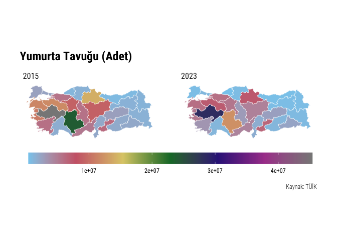
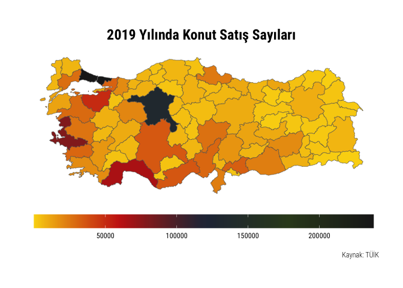
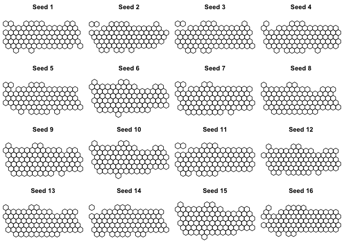

<!-- README.md is generated from README.Rmd. Please edit that file -->

# tuik

<!-- badges: start -->

[](https://www.tidyverse.org/lifecycle/#experimental)
[](https://zenodo.org/badge/latestdoi/313863336)
[](https://github.com/emraher/tuik/actions/workflows/R-CMD-check.yaml)
<!-- badges: end -->

The goal of `tuik` is to extract data file and database URLs from
[TUIK](https://data.tuik.gov.tr/) webpage. Package can also download
data from [Geographical Statistics Portal](https://cip.tuik.gov.tr/).

## Installation

You can install the development version from
[GitHub](https://github.com/emraher/tuik) with:

``` r
# install.packages("devtools")
devtools::install_github("emraher/tuik")
```

## Example

``` r
library(tidyverse)
library(tuik)

(st <- statistical_themes())
#> # A tibble: 17 × 2
#>    theme_name                         theme_id
#>    <chr>                              <chr>   
#>  1 Adalet ve Seçim                    110     
#>  2 Bilim, Teknoloji ve Bilgi Toplumu  102     
#>  3 Çevre ve Enerji                    103     
#>  4 Dış Ticaret                        104     
#>  5 Eğitim, Kültür, Spor ve Turizm     105     
#>  6 Ekonomik Güven                     117     
#>  7 Enflasyon ve Fiyat                 106     
#>  8 Gelir, Yaşam, Tüketim ve Yoksulluk 107     
#>  9 İnşaat ve Konut                    116     
#> 10 İstihdam, İşsizlik ve Ücret        108     
#> 11 Nüfus ve Demografi                 109     
#> 12 Sağlık ve Sosyal Koruma            101     
#> 13 Sanayi                             114     
#> 14 Tarım                              111     
#> 15 Ticaret ve Hizmet                  115     
#> 16 Ulaştırma ve Haberleşme            112     
#> 17 Ulusal Hesaplar                    113

# stab <- statistical_tables("aaa")
#> Error in check_theme_id(theme) : 
#>  You should select a valid theme ID!

# stab <- statistical_tables(c(123, 143))
#> Error in check_theme_id(theme) : You can select only one theme!

(stab <- statistical_tables("110"))
#> # A tibble: 52 × 5
#>    theme_name      theme_id data_name                    data_date  datafile_url
#>    <chr>           <chr>    <chr>                        <date>     <chr>       
#>  1 Adalet ve Seçim 110      Hükümlü ve Tutuklu Sayısı    2021-11-02 http://data…
#>  2 Adalet ve Seçim 110      Suç Türü ve Medeni Durumuna… 2021-11-02 http://data…
#>  3 Adalet ve Seçim 110      İBBS, 1. Düzeyde, Suç Türü … 2021-11-02 http://data…
#>  4 Adalet ve Seçim 110      İBBS 3. Düzeyde, Daimi İkam… 2021-11-02 http://data…
#>  5 Adalet ve Seçim 110      Suç Türü ve Uyruğuna Göre C… 2021-11-02 http://data…
#>  6 Adalet ve Seçim 110      Suç Türü ve Eğitim Durumuna… 2021-11-02 http://data…
#>  7 Adalet ve Seçim 110      Suç Türü ve Suçun İşlendiği… 2021-11-02 http://data…
#>  8 Adalet ve Seçim 110      İBBS, 3. Düzeyde, Suç Türü … 2021-11-02 http://data…
#>  9 Adalet ve Seçim 110      Suç Türü ve Suçun İşlendiği… 2021-11-02 http://data…
#> 10 Adalet ve Seçim 110      İBBS 3. Düzeyde, Suçun İşle… 2021-11-02 http://data…
#> # ℹ 42 more rows

# sdb <- statistical_databases("aaa")
#> Error in check_theme_id(theme) : 
#>  You should select a valid theme ID!

# sdb <- statistical_databases(c(123, 143))
#> Error in check_theme_id(theme) : You can select only one theme!

(sdb <- statistical_databases(110))
#> # A tibble: 6 × 4
#>   theme_name      theme_id db_name                                        db_url
#>   <chr>           <chr>    <chr>                                          <chr> 
#> 1 Adalet ve Seçim 110      "Milletvekili Seçim Sonuçları "                http:…
#> 2 Adalet ve Seçim 110      "Mahalli İdareler Seçim Sonuçları "            http:…
#> 3 Adalet ve Seçim 110      "Cumhurbaşkanlığı Seçimi / Halk Oylaması Sonu… http:…
#> 4 Adalet ve Seçim 110      "Ceza İnfaz Kurumuna Giren Hükümlü İstatistik… http:…
#> 5 Adalet ve Seçim 110      "Güvenlik Birimine Gelen veya Getirilen Çocuk… http:…
#> 6 Adalet ve Seçim 110      "Ceza İnfaz Kurumundan Çıkan Hükümlü İstatist… http:…
```

**If you are having problems at this stage, please see this issue on
[GitHub](https://github.com/emraher/tuik/issues/2).**

``` r
# -------------------------------------------------------------------------- ###
# Saving Data Files----
# -------------------------------------------------------------------------- ###
# Read xls files into R
# NOTE: TUIK xls files are messy!!!
download.file(stab$datafile_url[1], destfile = "/tmp/file.xls")
(dt <- tibble::as_tibble(readxl::read_xls("/tmp/file.xls")))
#> # A tibble: 17 × 4
#>    `Hükümlü ve tutuklu sayısı, 2011-2020`                ...2        ...3  ...4 
#>    <chr>                                                 <chr>       <chr> <chr>
#>  1 "Prison population, 2011-2020"                         <NA>        <NA>  <NA>
#>  2 "Yıllar\nYears"                                       "Toplam\nT… "Erk… "Kad…
#>  3  <NA>                                                  <NA>        <NA>  <NA>
#>  4 "2011"                                                "128253"    "123… "460…
#>  5 "2012"                                                "136638"    "131… "490…
#>  6 "2013"                                                "144098"    "138… "519…
#>  7 "2014"                                                "158690"    "152… "578…
#>  8 "2015"                                                "177262"    "170… "650…
#>  9 "2016"                                                "200727"    "192… "837…
#> 10 "2017"                                                "232340"    "222… "989…
#> 11 "2018"                                                "264842"    "254… "104…
#> 12 "2019"                                                "291546"    "280… "114…
#> 13 "2020"                                                "266831"    "256… "106…
#> 14 "Kaynak: Ceza İnfaz Kurumu İstatistikleri, 2011-2020"  <NA>        <NA>  <NA>
#> 15 "Source: Prison Statistics, 2011-2020"                 <NA>        <NA>  <NA>
#> 16 "Bilgiler 31 Aralık tarihine göredir."                 <NA>        <NA>  <NA>
#> 17 "Data are given as at 31 December."                    <NA>        <NA>  <NA>


# Download file from URL
filename <- paste0(janitor::make_clean_names(stab$data_name[1]),
                   janitor::make_clean_names(stab$data_date[1]))

download.file(stab$datafile_url[1],
              destfile = paste0("/tmp/", filename, ".xls"),
              mode = "wb")


# -------------------------------------------------------------------------- ###
# All DB Links---- NOT WORKING AT THIS TIME. TUIK CHANGED THE PAGE
# -------------------------------------------------------------------------- ###
# all_dbs <- purrr::map_df(.x = st$theme_id, .f = ~statistical_databases(.x))
# 
# all_dbs %>%
#   dplyr::count(theme_name, name = "database_count")

# -------------------------------------------------------------------------- ###
# Download Geo Data----
# -------------------------------------------------------------------------- ###
# Download Variable Names and Codes
(dt <- geo_data())
#> # A tibble: 76 × 6
#>    var_name               var_num var_levels var_period var_source var_recordnum
#>    <chr>                  <chr>   <list>     <chr>      <chr>              <dbl>
#>  1 Atık hizmeti verilen … CVRBA-… <dbl [2]>  yillik     medas                  5
#>  2 Atıksu Arıtma Hizmeti… CVRAS-… <dbl [2]>  yillik     medas                  5
#>  3 Kişi Başı Günlük Atık… CVRAS-… <dbl [2]>  yillik     medas                  5
#>  4 Kanalizasyon Hizmeti … CVRAS-… <dbl [2]>  yillik     medas                  5
#>  5 İçme Suyu Şebekesi Bu… CVRBS-… <dbl [2]>  yillik     medas                  5
#>  6 İçme Suyu Arıtma Hizm… CVRBS-… <dbl [2]>  yillik     medas                  5
#>  7 Kişi Başına Elektrik … ENR-GK… <dbl [1]>  yillik     ilGosterg…             5
#>  8 Okuma Yazma Bilmeyen … ULE-GK… <dbl [3]>  yillik     medas                  5
#>  9 Sinema Salon Sayısı    SNM-GK… <dbl [2]>  yillik     medas                  5
#> 10 Sinema Film Sayısı     SNM-GK… <dbl [2]>  yillik     medas                  5
#> # ℹ 66 more rows


# Download data for a given level and variable
dt |> 
  filter(var_num == "SNM-GK160951-O33303")
#> # A tibble: 1 × 6
#>   var_name           var_num      var_levels var_period var_source var_recordnum
#>   <chr>              <chr>        <list>     <chr>      <chr>              <dbl>
#> 1 Sinema Film Sayısı SNM-GK16095… <dbl [2]>  yillik     medas                  5

(dt_x <- geo_data(variable_level = 3, 
                  variable_no = "SNM-GK160951-O33303", 
                  variable_source = "medas", 
                  variable_period = "yillik", 
                  variable_recnum = 5))
#> # A tibble: 405 × 3
#>    code  date  sinema_film_sayisi
#>    <chr> <chr> <chr>             
#>  1 39    2022  278               
#>  2 39    2021  144               
#>  3 39    2020  112               
#>  4 39    2019  368               
#>  5 39    2018  384               
#>  6 68    2022  128               
#>  7 68    2021  83                
#>  8 68    2020  53                
#>  9 68    2019  134               
#> 10 68    2018  86                
#> # ℹ 395 more rows

# (dt <- geo_data(4, "TFE-GK105747-O23001"))
#> Error in value[[3L]](cond) : 
#>  This data (TFE-GK105747-O23001) is not available at this NUTS level (level = 4)!!!

# -------------------------------------------------------------------------- ###
# Download Geo Map----
# -------------------------------------------------------------------------- ###
(dt_sf <- geo_map(9))
#> Simple feature collection with 1003 features and 4 fields
#> Geometry type: POINT
#> Dimension:     XY
#> Bounding box:  xmin: 25.8861 ymin: 35.9023 xmax: 44.5762 ymax: 42.0245
#> Geodetic CRS:  WGS 84
#> # A tibble: 1,003 × 5
#>    ad            tp    bs    bm          geometry
#>    <chr>      <int> <int> <int>       <POINT [°]>
#>  1 İSTANBUL       1     1     1 (29.0107 41.6219)
#>  2 ANKARA         1     1     1 (32.8478 39.9383)
#>  3 İZMİR          1     1     1 (27.1529 38.4102)
#>  4 DİYARBAKIR     1     1     1  (40.2125 37.924)
#>  5 ESKİŞEHİR      1     1     0 (30.4944 39.7685)
#>  6 ANTALYA        1     1     1 (30.6962 36.9071)
#>  7 HATAY          1     1     1 (36.1588 36.1988)
#>  8 MERSİN         1     1     0 (34.6544 36.8217)
#>  9 KAYSERİ        1     1     1 (35.8886 38.7222)
#> 10 MARDİN         1     1     0 (40.7377 37.3122)
#> # ℹ 993 more rows

(dt_sf <- geo_map(3))
#> Simple feature collection with 81 features and 5 fields
#> Geometry type: MULTIPOLYGON
#> Dimension:     XY
#> Bounding box:  xmin: 25.66 ymin: 35.81 xmax: 44.81 ymax: 42.1
#> Geodetic CRS:  WGS 84
#> # A tibble: 81 × 6
#>    code  bolgeKodu nutsKodu name           ad                           geometry
#>  * <chr> <chr>     <chr>    <chr>          <chr>              <MULTIPOLYGON [°]>
#>  1 9     TR32      TR321    AYDIN          AYDIN       (((28.2497 37.5499, 28.2…
#>  2 1     TR62      TR621    ADANA          ADANA       (((36.18 37.7096, 36.189…
#>  3 2     TRC1      TRC12    ADIYAMAN       ADIYAMAN    (((38.9199 37.8197, 38.9…
#>  4 3     TR33      TR332    AFYONKARAHİSAR AFYONKARAH… (((30.6098 38.2199, 30.5…
#>  5 7     TR61      TR611    ANTALYA        ANTALYA     (((32.1898 36.9604, 32.2…
#>  6 20    TR32      TR322    DENİZLİ        DENİZLİ     (((28.76 37.2496, 28.729…
#>  7 37    TR82      TR821    KASTAMONU      KASTAMONU   (((33.7802 41.0398, 33.7…
#>  8 10    TR22      TR221    BALIKESİR      BALIKESİR   (((26.9896 39.2999, 26.9…
#>  9 32    TR61      TR612    ISPARTA        ISPARTA     (((31.3504 37.5899, 31.3…
#> 10 35    TR31      TR310    İZMİR          İZMİR       (((27.6001 38.4797, 27.6…
#> # ℹ 71 more rows
```

## Map Examples

### NUTS-2

``` r
dt |> 
  filter(var_num == "HYV-GK1696800-O32507")
#> # A tibble: 1 × 6
#>   var_name                var_num var_levels var_period var_source var_recordnum
#>   <chr>                   <chr>   <list>     <chr>      <chr>              <dbl>
#> 1 Yumurta Tavuğu Sayısı … HYV-GK… <dbl [3]>  yillik     medas                  5

chicken <- geo_data(variable_level = 2, 
                    variable_no = "HYV-GK1696800-O32507", 
                    variable_source = "medas", 
                    variable_period = "yillik", 
                    variable_recnum = 20) %>% 
  dplyr::filter(date %in% c("2023", "2015")) |> 
  mutate(yumurta_tavugu_sayisi_adet = as.numeric(yumurta_tavugu_sayisi_adet),
         date = as.numeric(date))

geo_map(2) %>% 
  left_join(chicken) %>% 
  ggplot() +
  geom_sf(aes(fill = yumurta_tavugu_sayisi_adet), color = "white") +
  coord_sf(datum = NA) + 
  rcartocolor::scale_fill_carto_c(palette = "Safe") +
  hrbrthemes::theme_ipsum_rc() +
  theme(legend.position = "bottom", legend.key.width = unit(3, "cm")) +
  labs(fill = "",
       title = "Yumurta Tavuğu (Adet)",
       caption = "Kaynak: TÜİK") +
  facet_wrap(~date, ncol = 2)
```



### NUTS-3

``` r
dt |> 
  filter(var_num == "INS-GK055-O006")
#> # A tibble: 1 × 6
#>   var_name                var_num var_levels var_period var_source var_recordnum
#>   <chr>                   <chr>   <list>     <chr>      <chr>              <dbl>
#> 1 Konut satış sayıları (… INS-GK… <dbl [1]>  yillik     ilGosterg…             5

house <- geo_data(variable_level = 3, 
                  variable_no = "INS-GK055-O006", 
                  variable_source = "ilGostergeleri", 
                  variable_period = "yillik", 
                  variable_recnum = 5) %>% 
  filter(date == 2019)

# Let's select different colors
pal <- wesanderson::wes_palette("BottleRocket2", 50, type = "continuous")

geo_map(3) %>% 
  left_join(house) %>% 
  mutate(konut_satis_sayilari_toplam = as.numeric(konut_satis_sayilari_toplam)) %>%
  ggplot() +
  geom_sf(aes(fill = konut_satis_sayilari_toplam)) +
  coord_sf(datum = NA) + 
  scale_fill_gradientn(colours = pal) + 
  hrbrthemes::theme_ipsum_rc() +
  theme(legend.position = "bottom", 
        legend.key.width = unit(3, "cm"),
        plot.title = element_text(hjust = 0.5)) +
  labs(fill = "",
       title = "2019 Yılında Konut Satış Sayıları",
       caption = "Kaynak: TÜİK")
```



### LAU-1

``` r
dt |> 
  filter(var_num == "ULE-GK160887-O29502")
#> # A tibble: 1 × 6
#>   var_name                var_num var_levels var_period var_source var_recordnum
#>   <chr>                   <chr>   <list>     <chr>      <chr>              <dbl>
#> 1 Okuma Yazma Bilmeyen S… ULE-GK… <dbl [3]>  yillik     medas                  5

pal <- c("#f7f7f7", "#d9d9d9", "#bdbdbd", "#969696", "#737373", "#525252", "#252525")

geo_data(variable_level = 4, 
         variable_no = "ULE-GK160887-O29502", 
         variable_source = "medas", 
         variable_period = "yillik", 
         variable_recnum = 5) %>% 
  filter(date == 2022) %>% 
  left_join(geo_map(level = 4), .) %>% 
  mutate(okuma_yazma_bilmeyen_sayisi = as.numeric(okuma_yazma_bilmeyen_sayisi)) |> 
  ggplot() +
  geom_sf(aes(fill = okuma_yazma_bilmeyen_sayisi), lwd = 0.1) +
  coord_sf(datum = NA) + 
  scale_fill_gradientn(colours = pal) +
  theme_bw() +
  theme(legend.position = "bottom", 
        legend.key.width = unit(3, "cm"),
        plot.title = element_text(hjust = 0.5)) +
  labs(fill = "",
       title = "2019 Yılında Okuma Yazma Bilmeyen Sayısı",
       caption = "Kaynak: TÜİK")
```


``` r
geo_data(variable_level = 4, 
         variable_no = "ADNKS-GK137473-O29001", 
         variable_source = "medas", 
         variable_period = "yillik", 
         variable_recnum = 5) |> 
  filter(date == 2019) %>% 
  left_join(geo_map(level = 4), .) %>% 
  mutate(toplam_nufus = as.numeric(toplam_nufus)) |>
  filter(bolgeKodu == "TR51") %>% 
  ggplot() +
  geom_sf(aes(fill = toplam_nufus)) +
  scale_fill_viridis_c(option = "E") +
  labs(fill = "Population in 2019") +
  hrbrthemes::theme_ipsum_rc()
```


### Hex and Dorling

``` r
library(tidyverse)
library(sf)
library(cartogram)
library(geogrid)
library(tuik)

# -------------------------------------------------------------------------- ###
# Hex----
# -------------------------------------------------------------------------- ###
# Read map data and transform CRS
tur_hex_map <- st_transform(geo_map(level = 3), crs = 3395)

dt |> 
  filter(var_num == "ULS-GK093-O009")
#> # A tibble: 1 × 6
#>   var_name                var_num var_levels var_period var_source var_recordnum
#>   <chr>                   <chr>   <list>     <chr>      <chr>              <dbl>
#> 1 Bin kişi başına otomob… ULS-GK… <dbl [1]>  yillik     ilGosterg…             5


# Read data and merge
tur_hex_dt <- geo_data(variable_level = 3, 
                       variable_no = "ULS-GK093-O009", 
                       variable_source = "ilGostergeleri", 
                       variable_period = "yillik", 
                       variable_recnum = 5) %>% 
  filter(date == 2019) %>% 
  left_join(tur_hex_map, .)

# Choose one seed according to these plots
par(mfrow = c(4, 4), mar = c(0, 0, 2, 0))
for (i in 1:16) {
  new_cells <- calculate_grid(shape = tur_hex_dt, grid_type = "hexagonal", seed = i)
  plot(new_cells, main = paste("Seed", i, sep = " "))
}
```



``` r

# Create hex map
new_hex <- calculate_grid(shape = tur_hex_dt, grid_type = "hexagonal", seed = 9)
result_hex <- assign_polygons(tur_hex_dt, new_hex)

# Plot
result_hex %>% 
  mutate(name = stringr::str_replace(name, "AFYONKARAHİSAR", "AFYON")) %>% 
  mutate(name = stringr::str_replace(name, "KAHRAMANMARAŞ", "K.MARAŞ")) %>% 
  mutate(bin_kisi_basina_otomobil_sayisi = as.numeric(bin_kisi_basina_otomobil_sayisi)) |> 
  ggplot() +
  geom_sf(aes(fill = bin_kisi_basina_otomobil_sayisi), lwd = 0.1) +
  geom_sf_text(aes(label = name), color = "black", size = 2) +
  coord_sf(datum = NA) + 
  rcartocolor::scale_fill_carto_c(palette = "OrYel") +
  hrbrthemes::theme_ipsum_rc() +
  theme(legend.position = "bottom", 
        legend.key.width = unit(3, "cm"),
        plot.title = element_text(hjust = 0.5)) +
  labs(fill = "",
       y = "",
       x = "",
       title = "2019 Yılında Bin Kişi Başına Otomobil Sayısı",
       caption = "Kaynak: TÜİK")
```


``` r
# -------------------------------------------------------------------------- ###
# Dorling----
# -------------------------------------------------------------------------- ###
# Read map data and transform CRS
tur_map <- st_transform(geo_map(level = 4), crs = 3395)

# Read data and merge
tur_pop <- geo_data(variable_level = 4, 
                    variable_no = "ADNKS-GK137473-O29001", 
                    variable_source = "medas", 
                    variable_period = "yillik", 
                    variable_recnum = 5)
tur_ill <- geo_data(variable_level = 4, 
                    variable_no = "ULE-GK160887-O29502", 
                    variable_source = "medas", 
                    variable_period = "yillik", 
                    variable_recnum = 5)

tur_dt <- left_join(tur_pop, tur_ill) %>% 
  filter(date == 2019) %>% 
  left_join(tur_map, .) %>% 
  mutate(okuma_yazma_bilmeyen_sayisi = as.numeric(okuma_yazma_bilmeyen_sayisi),
         toplam_nufus = as.numeric(toplam_nufus)) |> 
  mutate(value = 100*(okuma_yazma_bilmeyen_sayisi/toplam_nufus))

# Create dorling maps
tur_dorling1 <- cartogram_dorling(tur_dt, "okuma_yazma_bilmeyen_sayisi", 0.4)

tur_dorling1 %>% 
  ggplot() +
  geom_sf(aes(fill = okuma_yazma_bilmeyen_sayisi), lwd = 0.1) +
  coord_sf(datum = NA) + 
  scale_fill_viridis_c(option = "B") +
  theme_bw() +
  theme(legend.position = "bottom", 
        legend.key.width = unit(3, "cm"),
        plot.title = element_text(hjust = 0.5)) +
  labs(fill = "",
       title = "2019 Yılında Okuma Yazma Bilmeyen Sayısı",
       caption = "Kaynak: TÜİK")
```


``` r
tur_dorling2 <- cartogram_dorling(tur_dt, "toplam_nufus", 0.4)

tur_dorling2 %>% 
  ggplot() +
  geom_sf(aes(fill = toplam_nufus), lwd = 0.1) +
  coord_sf(datum = NA) + 
  scale_fill_viridis_c(option = "B") +
  theme_bw() +
  theme(legend.position = "bottom", 
        legend.key.width = unit(3, "cm"),
        plot.title = element_text(hjust = 0.5)) +
  labs(fill = "",
       title = "2019 Yılında Nüfus",
       caption = "Kaynak: TÜİK")
```


``` r
tur_dorling3 <- cartogram_dorling(tur_dt, "value", 0.4)

tur_dorling3 %>% 
  ggplot() +
  geom_sf(aes(fill = value), lwd = 0.1) +
  coord_sf(datum = NA) + 
  scale_fill_viridis_c(option = "B") +
  theme_bw() +
  theme(legend.position = "bottom", 
        legend.key.width = unit(3, "cm"),
        plot.title = element_text(hjust = 0.5)) +
  labs(fill = "",
       title = "2019 Yılında Okuma Yazma Bilmeyen Sayısının Nüfusa Oranı (%)",
       caption = "Kaynak: TÜİK")
```


